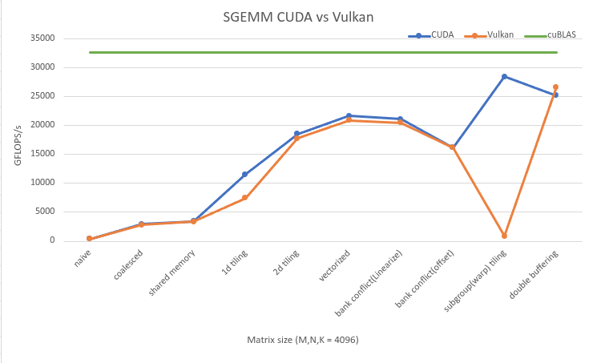
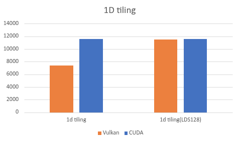
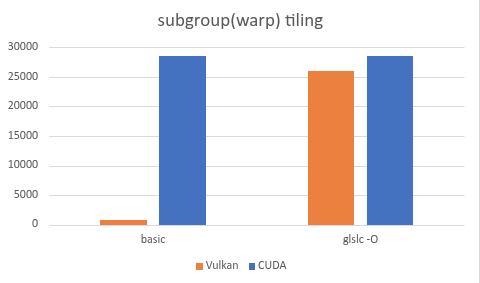

# GEMM_VULKAN

Study-oriented Vulkan SGEMM kernels, built by climbing the same optimization
ladder as the CUDA version and comparing where the Vulkan port diverges.

## Overview

At `M=N=K=4096`, Vulkan tracks the CUDA optimization ladder surprisingly
closely. The overall shape is the same: naive, coalesced, shared-memory,
2D tiling, vectorization, bank-conflict cleanup, and double buffering all move
in the expected direction. The two places where the first Vulkan port broke the
pattern were `1d tiling` and `subgroup(warp) tiling`.



Measured on `NVIDIA GeForce RTX 5070 Ti`.
FP32 `cuBLAS` reference at the same size: `32672.8` GFLOPs/s.

Main kernels with a direct CUDA counterpart:

| Kernel | Vulkan GFLOPs/s | Performance relative to CUDA | Performance relative to cuBLAS |
|:-------|----------------:|:-----------------------------|:-------------------------------|
| `naive` | `384.7` | `100.4%` | `1.2%` |
| `coalesced` | `2838.6` | `96.0%` | `8.7%` |
| `shared memory` | `3401.9` | `98.7%` | `10.4%` |
| `1d tiling` | `7429.9` | `64.3%` | `22.7%` |
| `2d tiling` | `17818.0` | `95.9%` | `54.5%` |
| `vectorized` | `20899.6` | `96.2%` | `64.0%` |
| `bank conflict(Linearize)` | `20537.6` | `97.0%` | `62.9%` |
| `bank conflict(offset)` | `16190.0` | `99.8%` | `49.6%` |
| `subgroup(warp) tiling` | `843.9` | `3.0%` | `2.6%` |
| `double buffering` | `26690.7` | `105.7%` | `81.7%` |

That makes this repo less about "port the CUDA code verbatim" and more about
understanding which CUDA ideas transfer directly, and which ones need to be
reshaped so that GLSL, SPIR-V, and the Vulkan shader compiler can still realize
the intended memory behavior.

## What Went Wrong With 1D Tiling

The first 1D tiling attempt kept the high-level idea from CUDA, but not the
memory behavior that made the CUDA version fast.



| Kernel | Vulkan GFLOPs/s | Performance relative to CUDA |
|:-------|----------------:|:-----------------------------|
| `1d tiling` | `7429.9` | `64.3%` |
| `1d tiling (lds)` | `11533.9` | `99.9%` |

The initial Vulkan kernel, [`03_thread_tiling_1d.comp`](shaders/sgemm/03_thread_tiling_1d.comp),
uses a very wide `workgroup_x=512` layout with `thread_n=1`. Each invocation
accumulates eight rows of `C`, so reuse happens mostly along `M`, while the
`N` direction is still streamed almost scalar-style. That means the kernel does
more work per thread, but it does not improve horizontal reuse enough to pay
for the extra LDS/shared-memory traffic.

The recovery came from changing the shape of the shared-memory path rather than
changing the tiling idea itself. The follow-up kernel,
[`03_thread_tiling_1d_shared_vec.comp`](shaders/sgemm/03_thread_tiling_1d_shared_vec.comp),
stages the tile through `vec4` LDS/shared-memory loads (`As4` and `Bs4`) and
computes each K-step with `dot(lhs, rhs)`. In the graph that shows up as the
`1d tiling(LDS128)` bar: same basic 1D tiling strategy, but with 128-bit
shared-memory transactions that remove most of the gap to CUDA.

## Why Subgroup Tiling Collapsed At First

The subgroup version failed for a different reason. Here the algorithmic idea
was already right, but the first GLSL implementation was written in a form that
the compiler handled badly.



| Kernel | Vulkan GFLOPs/s | Performance relative to CUDA |
|:-------|----------------:|:-----------------------------|
| `subgroup(warp) tiling` | `843.9` | `3.0%` |
| `subgroup(warp) tiling (glslc -O)` | `26082.0` | `91.5%` |
| `subgroup(warp) tiling (compiler friendly)` | `27663.0` | `97.0%` |

[`08_subgroup_tiling.comp`](shaders/sgemm/08_subgroup_tiling.comp) maps a CUDA
warp tile to a Vulkan subgroup tile and keeps the expected `128x128x16` block,
`64x64` subgroup tile, and register-resident accumulators. On paper that is the
right step. In practice, the original shader used deeply nested loops, generic
accumulator arrays, and dynamic indexing on both shared-memory loads and result
updates. The result was extremely poor realized throughput even though the
tiling hierarchy itself was sound.

Two changes fixed it:

1. Compile the original subgroup shader with `glslc -O`. The build does this
   specifically for `08_subgroup_tiling.comp`.
2. Add a compiler-friendly variant,
   [`08_subgroup_tiling_compiler_friendly.comp`](shaders/sgemm/08_subgroup_tiling_compiler_friendly.comp),
   which scalarizes and unrolls the accumulator path (`acc00` ... `acc73`) and
   simplifies the address arithmetic enough for the compiler to generate the
   code you actually wanted.

So the takeaway from this graph is not that subgroup tiling is a bad fit for
Vulkan. It is that subgroup tiling is much more sensitive to code shape and
compiler visibility than the earlier kernels.

## Takeaways

- CUDA optimization ideas transfer to Vulkan surprisingly well once the memory
  path and tiling hierarchy are preserved.
- 1D tiling was not fixed by a new algorithm; it was fixed by changing the LDS
  access width so the existing algorithm matched the hardware better.
- Subgroup tiling was not rescued by changing the math; it was rescued by
  writing a shader the compiler could optimize and then letting double
  buffering continue the climb.

## Later Vulkan Kernels

These kernels do not have a clean 1:1 CUDA counterpart in this README, so the
focus here is the Vulkan result itself. Both `swizzle` and `autotune` are
built on top of the `double buffering` kernel rather than being independent
from-scratch kernels.

| Kernel | Vulkan GFLOPs/s |
|:-------|----------------:|
| `swizzle` | `26494.8` |
| `autotune` | `27361.9` |
| `split-k` | `3039.6` |
| `scheduler` | `2264.2` |
| `stream-k` | `2247.6` |

## Build

Requirements:

- CMake 3.28+
- Vulkan loader and headers
- `glslc` or `glslangValidator`
- A Vulkan-capable GPU and driver

```bash
cmake -S . -B build
cmake --build build -j
```

## Run

List kernels:

```bash
./build/gemm_vulkan --list-kernels
```

Run a single kernel:

```bash
./build/gemm_vulkan --kernel 11 --m 4096 --n 4096 --k 4096 --iters 10
```

Write benchmark CSV output:

```bash
./build/gemm_vulkan --kernel 11 --m 4096 --n 4096 --k 4096 --iters 10 \
  --output results/benchmark/double_buffering.csv
```

## Kernel Ladder

| Id | Kernel | Notes |
|:--:|:-------|:------|
| 0 | `00_naive` | One invocation computes one `C` element from global memory. |
| 1 | `01_coalesced` | Access-pattern cleanup. |
| 2 | `02_shared_tiling` | Shared-memory tiled block GEMM. |
| 3 | `03_thread_tiling_1d` | First 1D thread-tiling attempt. |
| 4 | `04_thread_tiling_1d_shared_vec` | 1D tiling with `vec4` shared-memory loads. |
| 5 | `04_thread_tiling_2d` | 2D thread tiling. |
| 6 | `05_vectorized` | Vectorized memory access. |
| 7 | `06_bank_conflict_avoid` | Shared-memory bank-conflict mitigation. |
| 8 | `07_bank_conflict_padding` | Padded shared-memory stride. |
| 9 | `08_subgroup_tiling` | First subgroup-centric tiling pass. |
| 10 | `08_subgroup_tiling_compiler_friendly` | Scalarized compiler-friendly subgroup variant. |
| 11 | `09_double_buffering` | Double-buffered mainloop. |
| 12 | `10_tile_swizzle` | Swizzled workgroup-to-tile mapping built on top of double buffering. |
| 13 | `11_autotuned` | Autotune candidate slot built on top of double buffering. |
| 14 | `12_split_k` | Two-pass Split-K GEMM. |
| 15 | `13_persistent_scheduler` | Persistent output-tile scheduler. |
| 16 | `14_stream_k` | Persistent Split-K work scheduler. |
